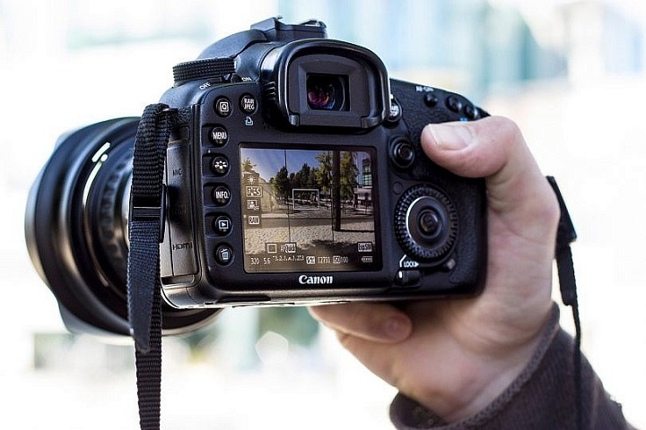
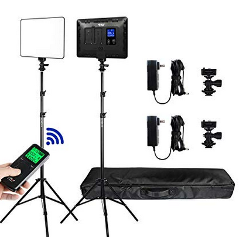
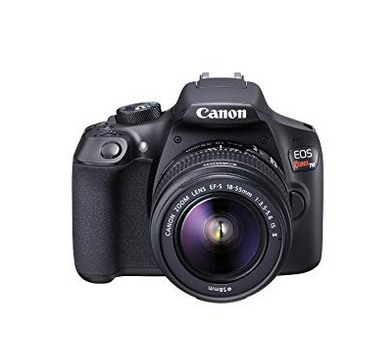
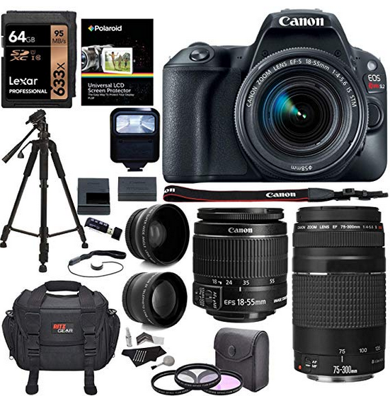

# Practica02-Misitioweb.css
 
<!doctype html>
<html lang="es">
<head>
<!--
    New Perspectives on HTML5 and CSS3, 7th Edition
    Tutorial 2
    Tutorial Case
    
    Tri and Succeed Sports
    Author: 
    Date:   

    Filename: tss_home.html
   -->

   <meta charset="utf-8" />
   <meta name="keywords" content="triathlon, running, swimming, cycling" />
   <title>Scale</title>
   <link href ="css/trescolumnas.css" rel ="stylesheet"/>
   <link href ="css/tss_styles_txt.css" rel ="stylesheet" />
</head>

<body>
   <header>
      
      
Centro fotografico

   </header>
   
   <nav id="nave">
      <h1>Navega</h1>
      <ul>
         <li><a href="index.html">Inicio</a></li>
         <li><a href="contactos.html">Contactos</a></li>
         <li><a href="nosotros.html">Nosostros</a></li>
         <li><a href="trabajos.html">Trabajos</a></li>
         <li><a href="servicios.html">Servicios</a></li>
         <li><a href="productos.html">Productos</a></li>
         <li><a href="localizanos.html">Localizanos</a></li>
         
        
      </ul>
   </nav>
   
   <article id="about_tss">
      <h1>Scale </h1>
      
      
Desde el 2014 ,<strong>Scale </strong> ha proporcionado a la ciudad
      de Cuenca un centro de arte que esta centrado en sacarle el mejor partido
      a sus clientes ,enseñarte e inspirarate a ser un dotador de posibilidades
      y a que el lente no sea tu limitante

      
¿Si quieres aumentar tu creatividad ? ,¿Aprender a usar la camara?
      ,ver como lo hacen los expertos ,saber manejar luz ,sacarle partido a todos 
      los lugares que visitas y a motivarte para ser el mejor este centro te puede 
      interesar.
      

      
      <h2>Talleres</h2>
      
Puedes recibir atencion personalizada en algunas ramas:

      <ul>
         <li><strong>Fotografia de moda</strong>: Los fotografos de moda deben 
            perfeccionar su ojo fotografico para lograr que las prendas usadas por
            el modelo resalten en la fotografia.Ademas de que logre proyectar las 
            prendas segun la norma o el objetivo con esta.</li>
         <li><strong>Fotografia de paisaje</strong>: Estos fotografos deben dominar 
            la composicion y la profundidad de campo Conocen conceptos como distancia
            Hiperfocal,escenas particulares ,entre otras.</li>
         <li><strong>Fotografia familiar</strong>: Estos fotografos estan destinados 
         a fotografiar a familias ,deben captar ,su amor y la personalidad de 
         cada uno</li>
         <li><strong> Fotografia de viajes</strong>:Estos fotografos salen con un gran
         equipo de herramientas ,les gusta viajar y capturar la belleza de las ciudades 
         y paisajes que visitan </li>
      </ul>
      
      
      <h2>Nuestra filosofia</h2>
      
Creemos que cada fotografo se debe formar primero de manera individual y luego sumarse
         a un colectivo.Se empieza con clases personalizadas ,para esto contamos con 100 expertos 
         en cada area que tendran un vinculo cercano con cada estudiante.
      

   </article>
   
   <aside id="come">
      <h1>Comentarios</h1>
      <blockquote> La primera vez que asisti a Scale me quede impresionada por la limpieza 
         de los cubiculos ,ademas las personas son muy amables.
      </blockquote>
      <blockquote> Yo ame estar 3 meses tomando clases .Aprendes todos los dias y los
         maestros son de primer nivel.
      </blockquote>
      <blockquote> Yo voy para un año y no me arrepiento ,gracias a este curso ahora estoy
         trabajando a en lo que amo y tengo gran cantidad de clientes.
      </blockquote>
      <blockquote> La escuela nunca deja de motivarte ,cada semana se hacen charlas con
         expositores internacionales y nacionales que te hacen amar mas la profesion.
      </blockquote>
      <blockquote> Si no cuentas con materiales para empezar ellos te venden una camara a plazos 
         para que no te detenga lo economico para aprender.
      </blockquote>
      <blockquote> Ultimamente estan dando becas por excelencia.Mi amiga se gano una y ha tenido
         muchas ventajas para poder cursar.Animate a pasar por aca y la escuela te dara muchas
         facilidades.
      </blockquote>
      <blockquote> Lo mejor de lo mejor.Son mucho mas de lo que uno espera.
      </blockquote>
      

   </aside>
   
   <footer>
      <address>
      Scale &#8226; Simon Bolivar 1-16. &#8226; Cuenca, EC
       &#8226; 0992726928
      </address>
   </footer>
</body>
</html>

<!doctype html>
<html lang="es">
<head>
<!--
    New Perspectives on HTML5 and CSS3, 7th Edition
    Tutorial 2
    Tutorial Case
    
    TSS Running Class
    Author: 
    Date:   

    Filename: tss_run.html
   -->
   <meta charset="utf-8" />
   <title>TSS Running Class</title>
   <link href = "css/tss_styles_txt.css" rel ="stylesheet"/>

</head>

<body id="bodylo">
   <header>
      
       
      
      
      <h3 id="lo">Localizanos</h3>
     
   </header>
   
   
   
   <nav id="navlo">
      <h1>Navega</h1>
      <ul>
         <li><a href="index.html">Inicio</a></li>
         <li><a href="contactos.html">Contactos</a></li>
         <li><a href="nosotros.html">Nosostros</a></li>
         <li><a href="trabajos.html">Trabajos</a></li>
         <li><a href="servicios.html">Servicios</a></li>
         <li><a href="productos.html">Productos</a></li>
         <li><a href="localizanos.html">Localizanos</a></li>
      </ul>
       <h1>Publicidad</h1>
       <ul>
           <li><a href ="https://www.tripadvisor.co/Attractions-g294309-Activities-Cuenca_Azuay_Province.html" >Lugares cerca</a></li>
            <li> <a href="https://www.tripadvisor.co/AttractionProductReview-g294309-d11991959-Biking_Cuenca_City_Tour-Cuenca_Azuay_Province.html" >Tour</a></li>
            <li> <a href="https://enviajes.cl/ecuador/cuenca/lugares-turisticos-de-cuenca/" >Lugares turisticos</a></li>
            <li> <a href="https://www.parks-and-tribes.com/turismo-amazonas/cuenca-ecuador.htm">¿Que hacer?</a></li>
            <li> <a href="https://www.elcomercio.com/actualidad/cuenca-turismo-dinero-ahorro-verano-precios.html">Cuenca</a></li>
            <li> <a href="https://www.tripadvisor.co/Restaurants-g294309-Cuenca_Azuay_Province.html" >Restaurantes</a></li>
            <li> <a href ="http://morterodepiedra.com/donde-comer-en-cuenca/" >¿Donde comer?</a></li>
        </ul>
   </nav>
   
  
   <article class="sylllo">
      <h1>Escribenos</h1>
      <h2>Puedes escribirme directamente a:</h2>
      <a href ="mailto:helencv1997@gmail.com?">Escribeme por aqui</a>
    
        <form action="/my-handling-form-page" method="post">
            

                <label for="name">Name:</label>
                <input type="text" id="name" />
            

            

                <label for="mail">E-mail:</label>
                <input type="email" id="mail" />
            

            

                <label for="msg">Message:</label>
                <textarea id="msg"></textarea>
            

            
            

                <button type="submit">Send your message</button>
            

        </form>
      
      
      
   </article>
   
   <aside id="asidelo">
         <h1>Comentarios</h1>
         <blockquote> La primera vez que asisti a Scale me quede impresionada por la limpieza 
            de los cubiculos ,ademas las personas son muy amables.
         </blockquote>
         <blockquote> Yo ame estar 3 meses tomando clases .Aprendes todos los dias y los
            maestros son de primer nivel.
         </blockquote>
         <blockquote> Yo voy para un año y no me arrepiento ,gracias a este curso ahora estoy
            trabajando a en lo que amo y tengo gran cantidad de clientes.
         </blockquote>
         <blockquote> La escuela nunca deja de motivarte ,cada semana se hacen charlas con
            expositores internacionales y nacionales que te hacen amar mas la profesion.
         </blockquote>
         
         
   
      </aside>
  

   <footer class="footerlo">
      <address>
      Tri and Succeed Sports &#8226; 41 Venture Dr. &#8226; Austin, 
      TX 78711 &#8226; 512.555.9917
      </address>
   </footer>
</body>
</html>

<!doctype html>
<html lang="es">
<head>
<!--
    New Perspectives on HTML5 and CSS3, 7th Edition
    Tutorial 2
    Tutorial Case
    
    TSS Running Class
    Author: 
    Date:   

    Filename: tss_run.html
   -->
   <meta charset="utf-8" />
   <title>TSS Running Class</title>
   <link href ="css/tss_styles_txt.css" rel ="stylesheet"/>

</head>

<body id="bodylo">
   <header>
      
       
      
      
      <h3 id="lo">Localizanos</h3>
     
   </header>
   
   
   
   <nav id="navlo">
      <h1>Navega</h1>
      <ul>
         <li><a href="index.html">Inicio</a></li>
         <li><a href="contactos.html">Contactos</a></li>
         <li><a href="nosotros.html">Nosostros</a></li>
         <li><a href="trabajos.html">Trabajos</a></li>
         <li><a href="servicios.html">Servicios</a></li>
         <li><a href="productos.html">Productos</a></li>
         <li><a href="localizanos.html">Localizanos</a></li>
      </ul>
       <h1>Publicidad</h1>
       <ul>
           <li><a href ="https://www.tripadvisor.co/Attractions-g294309-Activities-Cuenca_Azuay_Province.html" >Lugares cerca</a></li>
            <li> <a href="https://www.tripadvisor.co/AttractionProductReview-g294309-d11991959-Biking_Cuenca_City_Tour-Cuenca_Azuay_Province.html" >Tour</a></li>
            <li> <a href="https://enviajes.cl/ecuador/cuenca/lugares-turisticos-de-cuenca/" >Lugares turisticos</a></li>
            <li> <a href="https://www.parks-and-tribes.com/turismo-amazonas/cuenca-ecuador.htm">¿Que hacer?</a></li>
            <li> <a href="https://www.elcomercio.com/actualidad/cuenca-turismo-dinero-ahorro-verano-precios.html">Cuenca</a></li>
            <li> <a href="https://www.tripadvisor.co/Restaurants-g294309-Cuenca_Azuay_Province.html" >Restaurantes</a></li>
            <li> <a href ="http://morterodepiedra.com/donde-comer-en-cuenca/" >¿Donde comer?</a></li>
        </ul>
   </nav>
   
  
   <article class="sylllo">
      <h1>Visitanos</h1>
      
Visitanos en nuetsro local principal para darte informacion precisa.
        
      

      <iframe src="https://www.google.com/maps/embed?pb=!1m18!1m12!1m3!1d498.0900572531013!2d-79.00533799990698!3d-2.8966856917530936!2m3!1f0!2f0!3f0!3m2!1i1024!2i768!4f13.1!3m3!1m2!1s0x91cd1815fcf758cf%3A0xf0aaf8e788565350!2zU2ltw7NuIEJvbMOtdmFyLCBDdWVuY2E!5e0!3m2!1ses!2sec!4v1571949292412!5m2!1ses!2sec"></iframe>
      
   </article>
   
   <aside id="asidelo">
         <h1>Comentarios</h1>
         <blockquote> La primera vez que asisti a Scale me quede impresionada por la limpieza 
            de los cubiculos ,ademas las personas son muy amables.
         </blockquote>
         <blockquote> Yo ame estar 3 meses tomando clases .Aprendes todos los dias y los
            maestros son de primer nivel.
         </blockquote>
         <blockquote> Yo voy para un año y no me arrepiento ,gracias a este curso ahora estoy
            trabajando a en lo que amo y tengo gran cantidad de clientes.
         </blockquote>
         <blockquote> La escuela nunca deja de motivarte ,cada semana se hacen charlas con
            expositores internacionales y nacionales que te hacen amar mas la profesion.
         </blockquote>
         
         
   
      </aside>
  

   <footer class="footerlo">
      <address>
      Tri and Succeed Sports &#8226; 41 Venture Dr. &#8226; Austin, 
      TX 78711 &#8226; 512.555.9917
      </address>
   </footer>
</body>
</html>

<!doctype html>
<html lang="es">
<head>
<!--
    New Perspectives on HTML5 and CSS3, 7th Edition
    Tutorial 2
    Tutorial Case
    
    TSS Running Class
    Author: 
    Date:   

    Filename: tss_run.html
   -->
   <meta charset="utf-8" />
   <title>TSS Running Class</title>
   <link href ="css/tss_styles_txt.css" rel ="stylesheet"/>

</head>

<body id="bodyser">
   <header>
      
       
      
      
      <h3 id="lo">Centro de estudios fotograficos</h3>
     
   </header>
   
   
   
   <nav id="navser">
      <h1>Navega</h1>
      <ul>
         <li><a href="index.html">Inicio</a></li>
         <li><a href="contactos.html">Contactos</a></li>
         <li><a href="nosotros.html">Nosostros</a></li>
         <li><a href="trabajos.html">Trabajos</a></li>
         <li><a href="servicios.html">Servicios</a></li>
         <li><a href="productos.html">Productos</a></li>
         <li><a href="localizanos.html">Localizanos</a></li>
      </ul>
        <h1>Publicidad</h1>
         <ul>
            <li><a href="https://www.facebook.com/Fottografos/">Pagina de Facebook</a></li>
            <li><a href ="https://www.tripadvisor.co/Attractions-g294309-Activities-Cuenca_Azuay_Province.html" >Lugares cerca</a></li>
            <li> <a href="https://www.tripadvisor.co/AttractionProductReview-g294309-d11991959-Biking_Cuenca_City_Tour-Cuenca_Azuay_Province.html" >Tour</a></li>
            <li> <a href="https://enviajes.cl/ecuador/cuenca/lugares-turisticos-de-cuenca/" >Lugares turisticos</a></li>
            <li> <a href="https://www.parks-and-tribes.com/turismo-amazonas/cuenca-ecuador.htm">¿Que hacer?</a></li>
            <li> <a href="https://www.elcomercio.com/actualidad/cuenca-turismo-dinero-ahorro-verano-precios.html">Cuenca</a></li>
            <li> <a href="https://www.tripadvisor.co/Restaurants-g294309-Cuenca_Azuay_Province.html" >Restaurantes</a></li>
            <li> <a href ="http://morterodepiedra.com/donde-comer-en-cuenca/" >¿Donde comer?</a></li>
            
         </ul>
   </nav>

   
  
   <article class="syllser">
      <h1>Quienes somos</h1>
      
      
En 2014 abrimos nuetra primera sucursal ubicada en un pequeño local de la Simon Bolivar
         ,Centro.Para el 2018 ya contabamos con 4 sucursales mas ,incluida una en Azogues.
      

      
Empezamos con alrededor de 20 alumnos .Hoy en dia son 2000 alumnos que se preparan en 
         nuestras sedes.Cada dia es un compromiso para la institucion brindarles lo mejor en 
         tecnologia ,ambientes confiables y confortables ,para su asertiva asimilacion de contenidos.
         Los alumnos estan coprometidos con la institucion ,mas aun nuestra institucion con ellos.
      

      
Atendemos todos los dias de Lunes a Viernes:

      
      <ul>
         <li>8:00 AM - 1:00 PM </li>
         <li>3:00 PM - 7:30 PM </li>
      </ul>
      
      <h1>Personal</h1>
      
      
Contamos con expertos especializados en el extranjero en areas de calidad para brindar 
         soporte a los estudiantes.
      

      
   </article>
   
   <aside id="asideser">
         <h3>Comentarios</h3>
         <blockquote> La primera vez que asisti a Scale me quede impresionada por la limpieza 
            de los cubiculos ,ademas las personas son muy amables.
         </blockquote>
         <blockquote> Yo ame estar 3 meses tomando clases .Aprendes todos los dias y los
            maestros son de primer nivel.
         </blockquote>
         <blockquote> Yo voy para un año y no me arrepiento ,gracias a este curso ahora estoy
            trabajando a en lo que amo y tengo gran cantidad de clientes.
         </blockquote>
         <blockquote> La escuela nunca deja de motivarte ,cada semana se hacen charlas con
            expositores internacionales y nacionales que te hacen amar mas la profesion.
         </blockquote>
         
         
   
      </aside>
  

   <footer class="footerser">
      <address>
      Tri and Succeed Sports &#8226; 41 Venture Dr. &#8226; Austin, 
      TX 78711 &#8226; 512.555.9917
      </address>
   </footer>
</body>
</html>

<!doctype html>
<html lang="es">
<head>
<!--
    New Perspectives on HTML5 and CSS3, 7th Edition
    Tutorial 2
    Tutorial Case
    
    TSS Swimming Class
    Author: 
    Date:   

    Filename: tss_swim.html
   -->
   <meta charset="utf-8" />
   <title>TSS Swimming Class</title>
   <link href ="css/tss_styles_txt.css" rel ="stylesheet" />
</head>

<body id="bodypro">
   <header>
      
      <h3 id="lo">Centro de estudios fotograficos</h3>
   </header>
   
   <nav id="navepro">
      <h1>Navega</h1>
      <ul>
            <li><a href="index.html">Inicio</a></li>
            <li><a href="contactos.html">Contactos</a></li>
            <li><a href="nosotros.html">Nosostros</a></li>
            <li><a href="trabajos.html">Trabajos</a></li>
            <li><a href="servicios.html">Servicios</a></li>
            <li><a href="productos.html">Productos</a></li>
            <li><a href="localizanos.html">Localizanos</a></li>
      </ul>
      <h1>Publicidad</h1>
      <ul>
         <li> <a href="https://www.amazon.com/Cámara-digital-PowerShot-180-1093-C001-20-0-Mp-visualización/dp/B019UDHT6U/ref=sxbs_sp_mra?__mk_es_US=ÅMÅŽÕÑ&keywords=camaras&pd_rd_i=B019UDHT6U&pd_rd_r=bf1f67f7-3679-43d8-97c0-2446ef8b72e1&pd_rd_w=MIDi0&pd_rd_wg=zvhlP&pf_rd_p=2e675d27-2176-48bd-bab7-a89e5b36d9de&pf_rd_r=0NQ0G6NAVQCZJ1MPXC0H&qid=1571952788&s=digital-text" >Canon Power Shot</a></li>
         <li> <a href ="https://www.amazon.com/Panasonic-DC-ZS70K-Megapíxeles-Pantalla-Vario-Elmar/dp/B071R6JRZZ/ref=pd_rhf_se_s_sspa_dk_rhf_search_pt_sub_0_4/140-3520885-8765269?_encoding=UTF8&pd_rd_i=B071R6JRZZ&pd_rd_r=b3e5dd41-8db7-41a0-9eb6-048ce63464e5&pd_rd_w=9ghPj&pd_rd_wg=PXsIl&pf_rd_p=6b99a1a0-3d79-4d28-99ba-822278a5e800&pf_rd_r=A7WY41NZA5R4HG6TXA5E&psc=1&refRID=A7WY41NZA5R4HG6TXA5E&spLa=ZW5jcnlwdGVkUXVhbGlmaWVyPUEzQlRYTzcxRlpMOTRMJmVuY3J5cHRlZElkPUEwNTI2MjA3M0ZINzZGMU8zWU8xQyZlbmNyeXB0ZWRBZElkPUEwNDE5NzUzMk5XQUdPVVdGVVUzJndpZGdldE5hbWU9c3BfcmhmX3NlYXJjaCZhY3Rpb249Y2xpY2tSZWRpcmVjdCZkb05vdExvZ0NsaWNrPXRydWU=" >Lumix</a></li>
         <li> <a href ="https://www.amazon.com/Amplim-Tarjeta-microSDXC-adaptador-unidades/dp/B07SC4XDJN/ref=sr_1_15_sspa?__mk_es_US=ÅMÅŽÕÑ&keywords=flash+drive&qid=1571953307&s=electronics&sr=1-15-spons&psc=1&spLa=ZW5jcnlwdGVkUXVhbGlmaWVyPUEyODlFU09DMzA5VUo1JmVuY3J5cHRlZElkPUEwNDQzMTg1MlJCQjI4MDZXVFlFTSZlbmNyeXB0ZWRBZElkPUEwNzQ5MTc2MzlKVEwyOE5RVDFTRyZ3aWRnZXROYW1lPXNwX210ZiZhY3Rpb249Y2xpY2tSZWRpcmVjdCZkb05vdExvZ0NsaWNrPXRydWU=">Tarjestas</a></li>
      </ul>
   </nav>   
   
   <article class="syllpro">
      <h1>Productos/Ventas </h1>
      <h3 id="h3"> 
         Estos son los productos que tenemos en venta en nuestro almacen:
      </h3>
      
      

         <i>Viltrox VL-200T</i> kit de iluminacion de video ,luz de video LED bicolor.
         Sistema de doble temperatura de color,brillo y escalonamientos.
         <b>Precio:US$133.99</b>
      

      

         
      

      

      La <i>Emart </i> kit de iluminacion de fotografia portatil continua con 60 LED
      para lampara de mesa de estudio ,con filtros de color.Ideal para fotografiar productos.
      <b>Precio:US$29.99</b>
      

      
 
         
      

      
       

        La <i> Canon EOS Rebel T6 camara</i> con lente EF-S de 18-55 mm f/3.5-5.6 
        Wifi incorporado y comunicacion de campo cercano.
        <b>Precio:US$399.00</b>
       

       
       

         
       

       

         <i>Canon SL2 VAR</i> La Cannon EOS Rebel DSLR Camera with EF-S 18-55mm.
         64GB Memory Card ,Card Reader ,Memory Card  Wallet.
         58mm 2.2x Telephoto Lens.
         50" Video Tripod,Pro Slave Flash.
         <b>Precio:US$699.99</b>
       

         
       

         
       

       

         <i>Fujifilm Instax Mini 9</i> -Camara instantanea y mini pelicula Fuji INSTAX 
         (2) .Produce impresiones de credito card-sized,lente Fujinon 60mm f/12,7 ;visor 
         optico con diana Spot.<b>Precio:US$99.99</b>
       

       

         
       

   </article>
   
   <aside id="asidepro">
      <h3>Comentarios</h3>
      <blockquote> La primera vez que asisti a Scale me quede impresionada por la limpieza 
         de los cubiculos ,ademas las personas son muy amables.
      </blockquote>
      <blockquote> Yo ame estar 3 meses tomando clases .Aprendes todos los dias y los
         maestros son de primer nivel.
      </blockquote>
      <blockquote> Yo voy para un año y no me arrepiento ,gracias a este curso ahora estoy
         trabajando a en lo que amo y tengo gran cantidad de clientes.
      </blockquote>
      <blockquote> La escuela nunca deja de motivarte ,cada semana se hacen charlas con
         expositores internacionales y nacionales que te hacen amar mas la profesion.
      </blockquote>
      
      

   </aside>

   <footer class="piepro">
      <address>
      Tri and Succeed Sports &#8226; 41 Venture Dr. &#8226; Austin, 
      TX 78711 &#8226; 512.555.9917
      </address>
   </footer>
</body>
</html>

<!doctype html>
<html lang="es">
<head>
<!--
    New Perspectives on HTML5 and CSS3, 7th Edition
    Tutorial 2
    Tutorial Case
    
    TSS Running Class
    Author: 
    Date:   

    Filename: tss_run.html
   -->
   <meta charset="utf-8" />
   <title>TSS Running Class</title>
   <link href ="css/tss_styles_txt.css" rel ="stylesheet"/>

</head>

<body id="bodyservi">
   <header>
      
       
      
      
      <h3 id="lo">Centro de estudios fotograficos</h3>
     
   </header>
   
   
   
   <nav id="navservi">
      <h1>Navega</h1>
      <ul>
         <li><a href="index.html">Inicio</a></li>
         <li><a href="contactos.html">Contactos</a></li>
         <li><a href="nosotros.html">Nosostros</a></li>
         <li><a href="trabajos.html">Trabajos</a></li>
         <li><a href="servicios.html">Servicios</a></li>
         <li><a href="productos.html">Productos</a></li>
         <li><a href="localizanos.html">Localizanos</a></li>
      </ul>
        <h1>Publicidad</h1>
         <ul>
            <li><a href="https://www.facebook.com/Fottografos/">Pagina de Facebook</a></li>
            <li><a href ="https://www.tripadvisor.co/Attractions-g294309-Activities-Cuenca_Azuay_Province.html" >Lugares cerca</a></li>
            <li> <a href="https://www.tripadvisor.co/AttractionProductReview-g294309-d11991959-Biking_Cuenca_City_Tour-Cuenca_Azuay_Province.html" >Tour</a></li>
            <li> <a href="https://enviajes.cl/ecuador/cuenca/lugares-turisticos-de-cuenca/" >Lugares turisticos</a></li>
            <li> <a href="https://www.parks-and-tribes.com/turismo-amazonas/cuenca-ecuador.htm">¿Que hacer?</a></li>
            <li> <a href="https://www.elcomercio.com/actualidad/cuenca-turismo-dinero-ahorro-verano-precios.html">Cuenca</a></li>
            <li> <a href="https://www.tripadvisor.co/Restaurants-g294309-Cuenca_Azuay_Province.html" >Restaurantes</a></li>
            <li> <a href ="http://morterodepiedra.com/donde-comer-en-cuenca/" >¿Donde comer?</a></li>
         </ul>
   </nav>

   
  
   <article class="syllservi">
      <h1>Servicios que realizamos</h1>
      <h2>Fotografia Corporativa y Eventos</h2>
      
Logramos que su empresa y evento obtenga reconocimiento visual gracias a nuestro desempeño 

          <h3>Incluye:</h3>
          <ul>
              <li>Fotografia plana</li>
              <li>Fotografia esferica en 360°</li>
              <li>Video Full HD.Tiempo maximo de 25 min</li>
              <li>Video en 4k en 360°</li>
          </ul>
    
      
      <h2>Fotografia de Negocio</h2>
      
      
La fotografia arquitectonica para tu tienda fisica ,tanto interiores ,como exteriores.
      

      <h3>Incluye:</h3>
      <ul>
          <li>Fotografia Plana</li>
          <li>Fotografia esferica en 360°</li>
          <li>Video full HD</li>
          <li>Video 4k</li>
      </ul>
      <h2>Fotografia de Producto y Bodegon</h2>
      

          Debe mostrar las caracteristicas del mismo.Fotografia optimizada para tu tienda
          Online.
      

      <h2>Fotografia de Embarazo y bebe </h2>
      
 Guarda estos momentos especiales a traves de la fotografia.Se realiza en la comodidad de 
          tu casa ,en exteriores y en estudio.
      

   </article>
   
   <aside id="asideservi">
         <h3>Comentarios</h3>
         <blockquote> La primera vez que asisti a Scale me quede impresionada por la limpieza 
            de los cubiculos ,ademas las personas son muy amables.
         </blockquote>
         <blockquote> Yo ame estar 3 meses tomando clases .Aprendes todos los dias y los
            maestros son de primer nivel.
         </blockquote>
         <blockquote> Yo voy para un año y no me arrepiento ,gracias a este curso ahora estoy
            trabajando a en lo que amo y tengo gran cantidad de clientes.
         </blockquote>
         <blockquote> La escuela nunca deja de motivarte ,cada semana se hacen charlas con
            expositores internacionales y nacionales que te hacen amar mas la profesion.
         </blockquote>
         
         
   
      </aside>
  

   <footer class="footerservi">
      <address>
      Tri and Succeed Sports &#8226; 41 Venture Dr. &#8226; Austin, 
      TX 78711 &#8226; 512.555.9917
      </address>
   </footer>
</body>
</html>

<!doctype html>
<html lang="es">
<head>
<!--
    New Perspectives on HTML5 and CSS3, 7th Edition
    Tutorial 2
    Tutorial Case
    
    TSS Cycling Class
    Author: 
    Date:   

    Filename: tss_bike.html
   -->
   <meta charset="utf-8" />
   <title>TSS Cycling Class</title>
   <link href ="css/doscolumnas.css" rel ="stylesheet" />
   <link href ="css/tss_styles_txt.css" rel ="stylesheet" />

</head>

<body>
   <header>
      
     
   </header>
   
   <nav id="navetra">
      <h1>Navega</h1>
      <ul>
            <li><a href="index.html">Inicio</a></li>
            <li><a href="contactos.html">Contactos</a></li>
            <li><a href="nosotros.html">Nosostros</a></li>
            <li><a href="trabajos.html">Trabajos</a></li>
            <li><a href="servicios.html">Servicios</a></li>
            <li><a href="productos.html">Productos</a></li>
            <li><a href="localizanos.html">Localizanos</a></li>
      </ul>
   </nav>   
   
   <article class="syllabus">
      <h1>Trabajos Realizados</h1>
      
 
         Hemos realizados muchos trabajos y muchas variantes ramas:
      

      
      

         El <i>light painting</i> es una tecnica fotografica con exposiciones largas de luz
         .Se puede realizar si pintas en el aire con tu mano para que la fotografia capte las ondas
         de luz .Realizar light es muy sencillo ,configuras el ISO de la camara :ISO 100 ,el dia-
         fragma tambien debe cambiar en f/8 ,el efecto manual.
      

      

         
      

      

         El bodegon representa materia inanimada en un pequeño grupo de objetos.Se puede jugar con la
         composicion,buen uso de la iluminacion,composicion equilibrada y un buen angulo.
      

      
 
         
      

      
       

         La foto <i>Rastros de luz</i> deja ver al objeto como si salieran detellos luminosos de 
         el.Son exposiciones prolongadas de fuentes moviles de luz.Se requiere de una camara que 
         permita controlar la exposicion de la luz y las velocidades del obturador.ISO (bajo) ,
         velocidad de obturacion de 10 a 20 segundos,apertura de f/8.
       

       
       

         
       

       

         El recorrido que realizan las estrellas tambien se puede fotografiar ,esto se conoce
         como <i>star trails</i> o trazas estelares.Mientras mas cerca del Ecuador estes mayor
         movimiento de las estrellas.Camara que pueda estar en modo Buld,disparador remoto y un
         tripie.
       

         
       

         
       

       

         Composicion de la fotografia en blanco y negro tiene suma importancia porque los con
         trastes entre luces y sombras son mas grandes.Los detalles y la textura son necesarios 
         prestarle atencion.ISO(alto) 
       

       

         
       

   </article>
   
   <footer class="pie">
      <address>
      Tri and Succeed Sports &#8226; 41 Venture Dr. &#8226; Austin, 
      TX 78711 &#8226; 512.555.9917
      </address>
   </footer>
</body>
</html>

@charset "utf-8";

body {
	margin: 0 auto;
	width: 300%;
	max-width: 1300px;
	min-width: 940px;
}

body > header {
	margin: 10px;
	width: 96%;
	overflow: hidden;
	padding: 10px;
}

body > nav {
	width: 15%;
	float: left;
	margin: 0 0 0 1.0%;
	margin-top:20px;
}

body > article.syllabus {
	width: 80%;
	float: left;
	margin: 0 1.0% 0 1.0%;
	margin-top:20px;
}

body > article#about_tss img {
	float: right;
	width: 40%;
	margin: 0px 0 10px 10px;
}

article.syllabus {
    float: left;
	width: 74.5%;
	margin: 0 4% 0 0%;
}

body > footer {
	width: 100%;
	clear: left;
	margin-top:-5px;
	
}

@charset "UTF-8";

body {
	margin: 0 auto;
	width: 300%;
	max-width: 1300px;
	min-width: 940px;
}

body > header {
	margin: 10px;
	width: 96.4%;
	overflow: hidden;
	padding: 10px;
	width:1300px;
}

body > nav {
	width: 15%;
	float: left;
	margin: 0 0 0 1.0%;
	margin-top:20px;
}

body > article#about_tss {
	width: 60%;
	float: left;
	margin: 0 1.0% 0 1.0%;
	margin-top:20px;
}

body > aside {
	width: 20%;
	float: left;
	margin: 0 0 0 0;
	margin-top:20px;

}

body > article#about_tss img {
	float: right;
	width: 40%;
	margin: 0px 0 10px 10px;
}

article.syllabus {
    float: left;
	width: 74.5%;
	margin: 0 4% 0 0%;
}

body > footer {
	width: 100%;
	clear: left;
	margin-top:-5px;
	
}

@charset "utf-8"
/*
   New Perspectives on HTML5 and CSS3, 7th Edition
   Tutorial 2
   Tutorial Case
   
   TSS Typographic Style Sheet
   Author: 
   Date:   
   
   Filename: tss_styles.css

*/

/* HTML and Body Styles */
html
{
   background-color: #c70039;
   border:solid;
   border-bottom-width: 0.2em;
   
}

article{
   border:solid;
}

nav{
   border:solid;
}

footer{
   border: solid;
}

header{
   border:solid;
   width: 200%;
 
}

img.imag {
   width: 1250px;

}

img.foto6 {
   width: 200px;
   height: 200px;
}

img.foto1 {
   width: 300px;
   height:300px ;
}

img.foto2 {
   width: 300px;
   height: 300px;
}

img.foto3 {
   width: 300px;
   height: 300px;
}

img.foto4 {
   width: 300px;
   height: 300px;
}

img.foto5 {
    width: 300x;
    height: 300px;
}

img.foto7 {
   width: 200px;
   height: 200px;
}
img.imacont {
   width: 1250px;
}

img.imatra {
   width: 1250px;
}

img.imaservi {
   width: 1250px;;
}

img.imapro {
   width: 1250px;
}

img.imalo {
   width: 1250px;
}
h3#lo{
   border-top-style: solid;
   width: 200%;
   margin:-2 auto;
   height: -10px;
   border-width: -200%;

}

@font-face {
   font-family: Quicksand;
   src:url('Quicksand-Regular.woff') format('woff'),
      url('Quicksand-Regular.ttf') format('truetype');
}

body
{
   color: #ff5733;
   background-color:#c70039;
   font-family: Verdana, Geneva,sans-serif;
   border:solid;
   
}

/* Heading Styles */

article#about_tss h1
{
   color:#c70039;
   background-color: #ff5733;
   font-size: 2.2em;
   right: 0.1em;
 
}

article.syll h1{
   
   background-color: #ffc305;
   font-size: 2.2em;
   color:  #ff5733;
   quotes: none;
   text-anchor: start;
   
}

article.syllpro h1{
   color:  #ff5733;
   background-color:#581845;
   font-size: 2.2em;
   line-height: normal;line-height: ;
   line-height: 1.2em;
   text-align: center;
}
article.syll h2{
   color: darkslategray;
   background-color:#ffc305;
   font-size: 2.2em;
   color:  #ff5733;
   text-decoration: #ff5733;
   font-weight: bold;
   background-repeat: no-repeat;
   background-position: center;
   text-transform: capitalize;
}
article#about_tss h2
{
   color: #ff5733;
   background-color: #ff5733;
   font-size: 1.5em;
}

aside#asideser h3 {
   background-color: #ffc305;
   color:#ff5733;

}
nav#nave h1 {
   background-color:#ff5733;
   color: #c70039;
}

a:visited{
   background-color: #c70039;
   
}
article.sylllo a:link {
   color:#ff5733
}
nav#navetra h1 {
   background-color:#ffc305;
   color: #ff5733;
   background-image: inherit;
   background-position: center;
   text-anchor: middle;
}

nav#navepro h1 {
   background-color:#581845;
   color: #ff5733;
   border-spacing: 0.2em;
}

article.syllservi h1,h2 {
   color:#ff5733;
   background-color: #900C3F;
   border-inline-start-color: #ff5733;
   flood-color: #ff5733;
   min-height: min-content;
   max-height: max-content;
}
nav#navservi h1 {
   color:#ff5733;
   text-align: center;
   font-variant: small-caps;
   font-kerning: normal;
}

nav#navservi ul {
   background-color: #900C3F;
   position: relative;
}
footer.footerservi address {
   background-color: #900C3F;
   line-height: 1.9em;
}
aside#asideservi h3{
   background-color: #900C3F;
   text-shadow: #ffc305;
   letter-spacing: 0.7em;
   word-spacing: 0.2em;|
   margin-left: 0.3em;
   white-space:nowrap;
   text-transform:none;
}

nav#navser h1 {
   background-color:#ffc305;
   color:  #ff5733;
   font-weight: 100px;
}

nav#navser ul{
   background-color: #ffc305;
}

nav#navepro ul {
   background-color: #581845;
}
nav#navetra ul {
   background-color:#ffc305;
}

nav#navlo ul {
   background-color:#900C3F;
}
aside#come h1 {
   background-color: #ff5733;
   color: #c70039;
}

article.sylllo h1,h1 {
  background-color: #900C3F;
  color: black;
}
aside#asidepro h3 {
   background-color: #581845;
}
h1, h2 {
 font-family: Quicksand,Verdana, Geneva,sans-serif;
 letter-spacing: 0.1em;
}

footer.pie address {
   background-color:#ffc305;
   color:  #ff5733;
}

article.sylllo h1 {
   color:#ff5733;
}

aside#asidelo h1 {
   color:#ff5733;
}
footer.footerlo address {
   background-color: #900C3F;
}
article.syllser h1{
   background-color:#ffc305;
   color: #ff5733;
}

article.syllabus h1,article.syllabus h2{
   background-color: #ffc305;
   color: #ff5733;
}

footer.footerser address{
   background-color:#ffc305;
}

footer.piepro address{
   background-color: #581845;
   color: #ff5733;
}
/* Aside and Blockquote Styles 

/* Navigation Styles */	

aside {
   font-size: 0.8em;
   border: solid;
   top:8px;
   right:20px;
   
}

aside blockquote {
   color:#ff5733;
   margin: 20px 5px;
   quotes :"\201C" "\201D"
   
}

/* List Styles */

nav > ul {
   line-height: 2em;
   list-style-type: none;
   padding-left: 5px;
   background-color: #ff5733;
   border: 1px solid #c70039;
   -moz-border-radius: 9px;
   -webkit-border-radius:9px;

}

nav > ul >li.newgroup {
   margin-top: 20px;
}

nav > ul > li > a:hover ,nav > ul > li > a:active {
   color: #ff5733;
}

article.syllpro h3 {
   background-color: #581845;
   color: #ff5733;
}

nav > ul > li > a:link,nav > ul > li > a:visited {
   color:#ff5733;
   text-decoration: none;
   background-color:#c70039;
}

nav > ul > li > a:hover ,nav > ul > li > a:active {
   color: #900C3F;
   text-decoration: underline;
}

img.imaser {
   width: 1250px;
}

article.syllservi ul li:first-of-type {
   list-style-image: url(../ima/cama.png);
   opacity: 0.2;
}

/*
article#about_tss ul li:nth-of-type(2) {
 list-style-image: url(bikeicon.png);
}

article#about_tss ul li:last-of-type {
   list-style-image: url(swimicon.png);
}
*/

aside blockquote::before {
   content: open-quote;
   font-family: 'Times New Roman', Times, serif;
   font-size: 1.6em;
   font-weight: bold;
}

aside blockquote::after {
   content: close-quote; 
   font-family: 'Times New Roman', Times, serif;
   font-size: 1.6em;
   font-weight: bold;
}

article.syllabus ol {
   list-style-type: upper-roman;
}

article.syllabus ol ol {
   list-style-type: upper-alpha;
}

article.syllabus ol ol ol {
   list-style-type: decimal;
}
/* Footer Styles */

body > footer address {
   background-color: #ff5733;
   color:#c70039;
   font:normal small-caps bold 0.9em/3em
        Quicksand,Verdana,Geneva,sans-serif;
   text-align: center;
}

nav#navlo h1{
 background-color: #900C3F;
 color: #ff5733;
 text-indent: 0.2em;
 
}

/*pagina base*/

form {
   /* Sólo para centrar el formulario a la página */
   margin: 0 auto;
   width: 400px;
   /* Para ver el borde del formulario */
   padding: 1em;
   border: 1px solid #CCC;
   border-radius: 1em;
}

form div + div {
   margin-top: 1em;
}

label {
   /* Para asegurarse que todos los labels tienen el mismo tamaño y están alineados correctamente */
   display: inline-block;
   width: 90px;
   text-align: right;
}

input, textarea {
   /* Para asegurarse de que todos los campos de texto tienen las mismas propiedades de fuente
      Por defecto, las areas de texto tienen una fuente con monospace */
   font: 1em sans-serif;

   /* Para darle el mismo tamaño a todos los campos de texto */
   width: 300px;
   -moz-box-sizing: border-box;
   box-sizing: border-box;

   /* Para armonizar el look&feel del borde en los campos de texto */
   border: 1px solid #999;
}

input:focus, textarea:focus {
   /* Para dar un pequeño destaque en elementos activos*/
   border-color: #000;
}

textarea {
   /* Para alinear campos de texto multilínea con sus labels */
   vertical-align: top;

   /* Para dar suficiente espacio para escribir texto */
   height: 5em;

   /* Para permitir a los usuarios cambiar el tamaño de cualquier textarea verticalmente
       No funciona en todos los navegadores */
   resize: vertical;
}

.button {
   /* Para posicionar los botones a la misma posición que los campos de texto */
   padding-left: 90px; /* mismo tamaño a todos los elementos label */
}
button {
   /* Este margen extra representa aproximadamente el mismo espacio que el espacio
      entre los labels y sus campos de texto */
   margin-left: .5em;
}

body#bodyser {
	margin: 0 auto;
	width: 100%;
	max-width: 1300px;
	min-width: 940px;
}

body#bodyser > header {
	margin: 10px;
	width: 100.4%;
	overflow: hidden;
   padding: 10px;
   width:1250px;
}

body#bodyser > nav {
	width: 20%;
	float: left;
	margin: 0 0 0 1.0%;
	margin-top:10px;
}

body#bodyser > article.syllser {
	width: 55%;
	float: left;
	margin: 0 1.0% 0 1.0%;
	margin-top:10px;
}

body#bodyser > aside#asideser {
	width: 18.4%;
	float: left;
   
   margin: 0 1.0% 0 1.0%;
	margin-top:10px;

}

article.syll {
    float: left;
	width: 74.5%;
	margin: 0 4% 0 0%;
}

body#bodyser > footer {
	width: 100%;
	clear: left;
	margin-top:-5px;
	
}

/*pagina productos*/
body#bodypro {
	margin: 0 auto;
	width: 100%;
	max-width: 1300px;
	min-width: 940px;
}

body#bodypro > header {
	margin: 10px;
	width: 96.4%;
	overflow: hidden;
   padding: 10px;
   width:1250px;
}

body#bodypro > nav#navepro {
	width: 20%;
	float: left;
	margin: 0 0 0 1.0%;
	margin-top:10px;
}

body#bodypro > article.syllpro {
	width: 55%;
	float: left;
	margin: 0 1.0% 0 1.0%;
	margin-top:10px;
}

body#bodypro > aside#asidepro {
	width: 18.4%;
	float: left;
   
   margin: 0 1.0% 0 1.0%;
	margin-top:10px;

}

article.syllser {
    float: left;
	width: 74.5%;
	margin: 0 4% 0 0%;
}

body#bodypro > footer {
	width: 100%;
	clear: left;
	margin-top:-5px;
	
}

/*pagina localizanos*/
body#bodylo {
	margin: 0 auto;
	width: 100%;
	max-width: 1300px;
	min-width: 940px;
}

body#bodylo > header {
	margin: 10px;
	width: 96.4%;
	overflow: hidden;
   padding: 10px;
   width:2000px;
}

body#bodylo > nav#navlo {
	width: 20%;
	float: left;
	margin: 0 0 0 1.0%;
	margin-top:10px;
}

body#bodylo > article.sylllo {
	width: 55%;
	float: left;
	margin: 0 1.0% 0 1.0%;
	margin-top:10px;
}

body#bodylo > aside#asidelo {
	width: 18.4%;
	float: left;
   
   margin: 0 1.0% 0 1.0%;
	margin-top:10px;

}

article.sylllo {
    float: left;
	width: 74.5%;
	margin: 0 4% 0 0%;
}

body#bodylo > footer {
	width: 100%;
	clear: left;
	margin-top:-5px;
	
}

/*pagina servicios*/
body#bodyservi {
	margin: 0 auto;
	width: 100%;
	max-width: 1300px;
	min-width: 940px;
}

body#bodyservi > header {
	margin: 10px;
	width: 96.4%;
	overflow: hidden;
   padding: 10px;
   width:1250px;
}

body#bodyservi > nav#navservi {
	width: 20%;
	float: left;
	margin: 0 0 0 1.0%;
	margin-top:10px;
}

body#bodyservi > article.syllservi {
	width: 55%;
	float: left;
	margin: 0 1.0% 0 1.0%;
	margin-top:10px;
}

body#bodyservi > aside#asideservi {
	width: 18.4%;
	float: left;
   
   margin: 0 1.0% 0 1.0%;
	margin-top:10px;

}

article.syllservi {
    float: left;
	width: 74.5%;
	margin: 0 4% 0 0%;
}

body#bodyservi > footer {
	width: 100%;
	clear: left;
	margin-top:-5px;
	
}

/*Pagina de contactos*/

body#bodylo {
	margin: 0 auto;
	width: 100%;
	max-width: 1300px;
	min-width: 940px;
}

body#bodylo > header {
	margin: 10px;
	width: 96.4%;
	overflow: hidden;
   padding: 10px;
   width:1250px;
}

body#bodylo > nav#navlo {
	width: 20%;
	float: left;
	margin: 0 0 0 1.0%;
	margin-top:10px;
}

body#bodylo > article.sylllo {
	width: 55%;
	float: left;
	margin: 0 1.0% 0 1.0%;
	margin-top:10px;
}

body#bodylo > aside#asidelo {
	width: 18.4%;
	float: left;
   
   margin: 0 1.0% 0 1.0%;
	margin-top:10px;

}

article.sylllo {
    float: left;
	width: 74.5%;
	margin: 0 4% 0 0%;
}

body#bodylo > footer {
	width: 100%;
	clear: left;
	margin-top:-5px;
	
}

/*
Notice for the Quicksand-Regular Font
------------------------------------------------------------------------------
SIL Open Font License v1.10

This license can also be found at this permalink: http://www.fontsquirrel.com/license/quicksand

Copyright (c) 2011, Andrew Paglinawan (http://www.andrewpaglinawan.com andrew.paglinawan@gmail.com), 
with Reserved Font Name “Quicksand”.

This Font Software is licensed under the SIL Open Font License, Version 1.1.
This license is copied below, and is also available with a FAQ at: http://scripts.sil.org/OFL

—————————————————————————————-
SIL OPEN FONT LICENSE Version 1.1 - 26 February 2007
—————————————————————————————-

PREAMBLE
The goals of the Open Font License (OFL) are to stimulate worldwide development of collaborative 
font projects, to support the font creation efforts of academic and linguistic communities, and 
to provide a free and open framework in which fonts may be shared and improved in 
partnership with others.

The OFL allows the licensed fonts to be used, studied, modified and redistributed freely as 
long as they are not sold by themselves. The fonts, including any derivative works, can 
be bundled, embedded, redistributed and/or sold with any software provided that any reserved 
names are not used by derivative works. The fonts and derivatives, however, cannot be released under 
any other type of license. The requirement for fonts to remain under this license does not apply 
to any document created using the fonts or their derivatives.

DEFINITIONS
“Font Software” refers to the set of files released by the Copyright Holder(s) under this 
license and clearly marked as such. This may include source files, build scripts and documentation.

“Reserved Font Name” refers to any names specified as such after the copyright statement(s).

“Original Version” refers to the collection of Font Software components as distributed by 
the Copyright Holder(s).

“Modified Version” refers to any derivative made by adding to, deleting, or substituting—in 
part or in whole—any of the components of the Original Version, by changing formats or by 
porting the Font Software to a new environment.

“Author” refers to any designer, engineer, programmer, technical writer or other person 
who contributed to the Font Software.

PERMISSION & CONDITIONS
Permission is hereby granted, free of charge, to any person obtaining a copy of the Font Software, 
to use, study, copy, merge, embed, modify, redistribute, and sell modified and unmodified copies of 
the Font Software, subject to the following conditions:

1) Neither the Font Software nor any of its individual components, in Original or Modified 
Versions, may be sold by itself.

2) Original or Modified Versions of the Font Software may be bundled, redistributed and/or 
sold with any software, provided that each copy contains the above copyright notice and this 
license. These can be included either as stand-alone text files, human-readable headers or in 
the appropriate machine-readable metadata fields within text or binary files as long as those 
fields can be easily viewed by the user.

3) No Modified Version of the Font Software may use the Reserved Font Name(s) unless explicit 
written permission is granted by the corresponding Copyright Holder. This restriction only applies 
to the primary font name as presented to the users.

4) The name(s) of the Copyright Holder(s) or the Author(s) of the Font Software shall not be used 
to promote, endorse or advertise any Modified Version, except to acknowledge the contribution(s) 
of the Copyright Holder(s) and the Author(s) or with their explicit written permission.

5) The Font Software, modified or unmodified, in part or in whole, must be distributed entirely 
under this license, and must not be distributed under any other license. The requirement for fonts 
to remain under this license does not apply to any document created using the Font Software.

TERMINATION
This license becomes null and void if any of the above conditions are not met.

DISCLAIMER
THE FONT SOFTWARE IS PROVIDED “AS IS”, WITHOUT WARRANTY OF ANY KIND, EXPRESS OR IMPLIED, 
INCLUDING BUT NOT LIMITED TO ANY WARRANTIES OF MERCHANTABILITY, FITNESS FOR A PARTICULAR PURPOSE 
AND NONINFRINGEMENT OF COPYRIGHT, PATENT, TRADEMARK, OR OTHER RIGHT. IN NO EVENT SHALL THE COPYRIGHT 
HOLDER BE LIABLE FOR ANY CLAIM, DAMAGES OR OTHER LIABILITY, INCLUDING ANY GENERAL, SPECIAL, INDIRECT, 
INCIDENTAL, OR CONSEQUENTIAL DAMAGES, WHETHER IN AN ACTION OF CONTRACT, TORT OR OTHERWISE, ARISING 
FROM, OUT OF THE USE OR INABILITY TO USE THE FONT SOFTWARE OR FROM OTHER DEALINGS IN THE FONT SOFTWARE.
*/

Reglas css:
1.	Margin 0 auto---Da un espacio horizontal con respecto al contenedor 
2.	Width-----especifica el ancho de una etiqueta
3.	Max-width----valor máximo de ancho
4.	Min-width-----valor minimo de ancho
5.	Overflow-----controla lo que sucede con el contenido que es demasiado grande para caber en un área.(hidden)-el desbordamiento se recorta y el resto del contenido esta visible.
6.	Padding-----establece espacio de relleno requerido por los lados de un elemento.
7.	Float-----especifica si un elemento debe salir del flujo normal y aparecer a la izquierda o a la derecha.(float)—el elemento flota a la derecha de su bloque contenedor.
8.	Margin-top-----margen superior de un elemento
9.	Clear----especifica si un elemento puede estar al lado de elementos flotantes que lo preceden o si deben ser movido debajo de ellos.
10.	Background-color---da color de fondo a un elemento.
11.	Border-------es una propiedad que permite especificar el estilo ,ancho ,color de un elemento.
12.	Border-top-style---------Da un estilo superior al borde
13.	Heigth--------------da largo
14.	Border-width------------da ancho al borde
15.	Font-family------da el tipo de letra
16.	Color--------------da color al elemento seleccionado
17.	Font-size--------da dimension a la letra
18.	Top--------------especifica posicionamiento de un elemento
19.	Right------------especifica para del posicionamiento de un elemento
20.	Quotes-----------indica como poner las citas
21.	Line-height----------establece la altura de una casilla remarcada por lineas
22.	List-style-type------------especifica la apariencia de un listado
23.	Padding-left-------------espacio en la izquierda.
24.	-moz-border-raduis--------redondear los bordes
25.	Text-decoration-------------el atributo define si el texto esta decorado con un subrayado
26.	Content------------se une con before o after para generar contenido que se adjunta
27.	Font-weight-------------especifica el peso o grueso de la letra
28.	Text-align---------------alinear el texto
29.	Border-radius---------da un borde redondeado
30.	Display---------------especifica el tipo de cuadro representación utilizando un elemento
31.	–moz-box-sizing---------
32.	Box-sizing-------- calcula ancho y banda
33.	Border-color--------da color al borde
34.	Vertical-align-------alinear de manera vertical
35.	Resize--------controla la capacidad de cambio de tamaño de un elemento
36.	Text-align---alinea el texto
37.	Font-variant------especifica aspecto de letra normal
38.	Font-weight---------especifica grueso de una letra
39.	Text-shadow--------agrega sombra al texto
40.	Letter-spacing----espaciado entre las letras 
41.	Word-spacing----espaciado entre las palabras
42.	Text-indent--------establece sangria de texto
  Margin-left-------margen a la izquierda
43.	Padding-left------da un espacio a la izquierda
44.	Background repeat------define como se repiten los fondos del documento
45.	Background-position—define la posicion inicial de la imagen
46.	Min-height----da un minimo de largo
47.	Opacity--------da opacidad a un elemento
48.	Position------da una posicion a un elemento
49.	Border-left----borde izquierdo
50.	Border-rigth---------borde derecho
51.	White-space--------determina como se maneja el espacio en blanco
52.	Font-style--------define el aspect de una familia tipografica
53.	Text-transform-----permite poner la primera letra mayúscula de un elemento
54.	Background-image-----------fondo imagen

Tutorial 02-TriAndSuccedSports
HelenCVM
https://github.com/HelenCVM/Tutorial02

Practica02-Mi sitio web(CSS)
HelenCVM

CONCLUSIONES:
Con la realización de esta práctica pude profundizar en los temas HTML Y CSS.Ademas de ver las reglas CSS y como se aplican a las diferentes etiquetas.

RECOMENDACIONES:
Utilizar W3school para poder hacer ejercicios y ver cómo funcionan las diferentes reglas.

